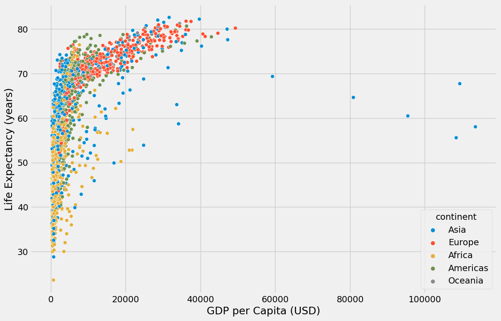
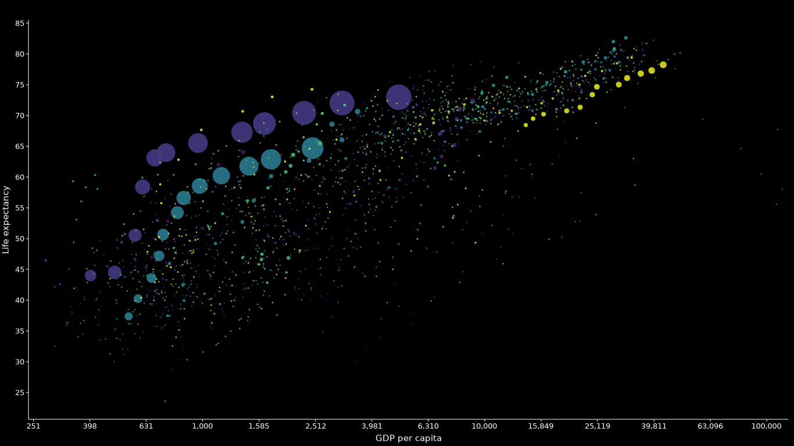
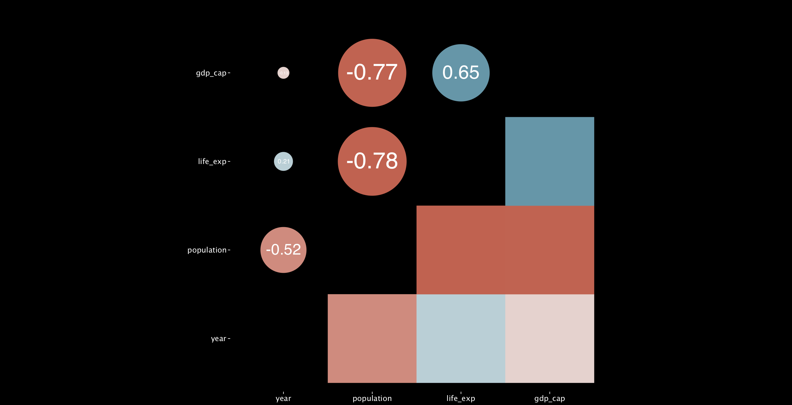

**Make better visualizations in python with grammar of graphics.**
---
<br>
<br>

Have you ever found yourself sitting through a data-heavy presentation that felt overwhelming and made your head hurt? I know the feeling all too well. But don't worry! There is a solution to this problem. You can make a significant difference by incorporating compelling graphics into your data presentations. Believe it or not, visuals can enhance comprehension, engage the audience, simplify complex concepts, support data-driven storytelling, improve retention and recall, and enhance credibility and professionalism. So, if you want to transform your data presentations and make them more impactful and effective, it's time to use visuals effectively.

As a data scientist, I understand that time can be a constraint when creating visuals for presentations. Balancing efficiency with visual appeal in the exploratory data analysis phase can be challenging. A common strategy is to screenshot your EDA plots and paste them into your presentation. Great visualization tools like Tableau might need you to export the data first; most people need more time for that. However, going the extra mile to create compelling visuals that effectively communicate your ideas to clients is essential, and more than simple PyPlots may be needed. But with the right approach, you can create efficient and visually appealing visuals within your notebook or console without needing to export the data.

In this oh-so article, I will show a demo of how you can create plots that will make your audience go "Aha!" instead of checking their Instagram feeds during your presentation. No more awkward PyPlot visuals that elicit yawns and glazed-over eyes. Let's dive into these magical secrets of the grammar of graphics.

First things first, let's install some packages.
<br>
```python 
! pip install lets-plot
```

And then ofcourse import packages

```python 
import pandas as pd
import numpy as np

import matplotlib.pyplot as plt
import seaborn as sns

import numpy as np
from lets_plot import *
LetsPlot.setup_html()
```

The data im using is available at this [link](gapminder_full.csv):

```python
data = 'your link to local file in file system here'
df = pd.read_csv('data.csv')
df.head(5)

```

Let's start by creating a usual matplotlib plot for visualizing life expectancy and GDP per capita for the different countries.  

```python
plt.style.use('fivethirtyeight')

plt.figure(figsize=(12,8))
sns.scatterplot(x='gdp_cap', y='life_exp', hue='continent', data=df)
plt.xlabel('GDP per Capita (USD)')
plt.ylabel('Life Expectancy (years)')
plt.show()
```

The output would print this scatter plot. 



Now, let's transform this plot to enhance comprehension, keep your audience engaged, and support your story using the grammar of graphics.
<br>
<br>

## **Grammr of graphics**
<br>
<br>

Whats grammer of graphics you may ask.
<br>

The grammar of graphics is an approach to data visualization API design that diverges in the extreme from that followed by other libraries like matplotlib, plotply, etc.
The data visualization design process starts with creating a figure (1), adjusting the geometry of that figure (2), then adjusting the aesthetics of that figure (3). With the other plotting libraries, when styling your plots, sometimes things blow up, making things more complex than they need to be (when do I use a parameter? When do I call a method?), creating a cranching headache.
<br>
<br>

The grammar of graphics solves this thorny issue. In grammar of graphics -based libraries (like ggplt, lets-plot etc), every operation is expressed the same way: using a function. In `ggplot` we create graphs by "adding up" our elements:


<br>
<br>

The Data element is a call to `ggplot`, which populates the data in the graph. The Aesthetics are controlled by the `aes` function, which populates visual variables: colors, shapes, and so on. Finally, Layers are functions that add to or modify the plot itself.
<br>
<br>

Now lets transform our plot using the grammar of graphics. 

```python
# (1) create a figure
ggplot(df, aes(x='gdp_cap', y='life_exp', color='continent', size = 'population')),  

# (2) adjust the geometry of the figure (here the geometry of the figure is geom_point)
geom_point(alpha=0.9,show_legend= False, stat= 'identity'),

# (3) adjust the asestetics of the figure
scale_color_viridis(option='D', direction=-1),
scale_size(range = [1, 15]),
ggtitle('GDP per capita and life expectancy'),
theme_classic(),
flavor_high_contrast_dark(),
scale_x_log10(),
xlab('GDP per capita') + ylab('Life expectancy'),
ggsize(1366, 768) # the size of the figure. Adjust to your presentation style

```
<br>
<br>

The code above can also be written in one block and assigned to a variable say `p` and you can call `p` anytime to render the figure.

```python
p = ggplot(df, aes(x='gdp_cap', y='life_exp', color='continent', size = 'population')) + \ 
        geom_point(alpha=0.9,show_legend= False, stat= 'identity') + \
        scale_color_viridis(option='D', direction=-1) + \
        scale_size(range = [1, 15]) + \
        ggtitle('GDP per capita and life expectancy') + \
            theme_classic() + \
                flavor_high_contrast_dark() + \
                scale_x_log10() + \
        xlab('GDP per capita') + ylab('Life expectancy') + \
        ggsize(1366, 768)
p
```

First, I instanciate the ggplot figure. and pass in my dataframe and the axes `aes`. I'm plotting gdp, life expectancy and the size of my geometry points (dots in this case) — population and coloring by continent.
<br>

Second I adjust the geometry of the figure (geom_pint, this is a scatter plot, the geometry is a dot or circle) and pass in alpha value, legend, and the most important argument stat = identity. The stat argument lets you create satistics from the data points, in this case I want the raw values (identity).
<br>

Third is adjusting the aesthetics of the figure. The color theme, you can change the color to whatever you like or aligns with your presentation theme. The canvas theme, I used classic (no grid lines and simple interface). The fith line is the flavour of the canvas, you can think of it as the theme too, I like high contrast dark for the black background that makes the colours pop and its easy to the eyes if you are presenting on zoom. The last two line are for the labels and size of the plot.
<br>

And viola
<br>



<br>
<br>
<br>

Let's create a simple correlation heatmap. You already know what the sns correlation heat maps look like, so I won't bore your senses with that. 

```python
from lets_plot.bistro.corr import *
data = df.corr().reset_index()
```
<br>

The Bistro module contains most common EDA tools to understand the underlying structure of the data contained, you can step this up if your presentation has elements of your EDA that need to be represented
<br>
<br>

```python
p = corr_plot(data, flip = False, threshold = 0.0).points().tiles().labels().build() +\
        theme_classic() +\
        flavor_high_contrast_dark() +\
        ggtitle(''' ''') + ggsize(1366, 700)

p
```




Overall, the Grammar of Graphics offers a structured and powerful approach to data visualization, enabling you to create expressive, customizable, and reproducible visualizations. It provides a solid foundation for creating visualizations that effectively communicate insights from your data


Thank you! 
-
